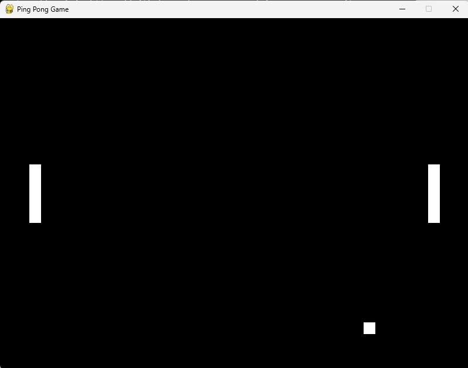

# Classic 2D Ping Pong Game

This is a simple implementation of the classic 2D ping pong game built with Python and Pygame.

## Screenshot

Below is a screenshot of the Ping Pong game:



## Requirements

- Python 3.x
- Pygame

## Installation

1. Clone the repository:
```
git clone https://github.com/henrywkk/ping-pong-game.git
```

2. Navigate to the project directory:

```
cd ping-pong-game
```

3. Install the required dependencies:
```
pip install -r requirements.txt
```

## Running the Game

To start the game, run the following command in the project directory:
```
python ping_pong.py
```

## How to Play

- **Player 1 (Left Paddle)**: Use `W` to move up and `S` to move down.
- **Player 2 (Right Paddle)**: Use `UP` arrow to move up and `DOWN` arrow to move down.
- The ball bounces off the top and bottom of the screen and the paddles.
- If the ball goes out of bounds (left or right), it resets to the center.

## License

This project is licensed under the MIT License - see the [LICENSE](LICENSE) file for details.